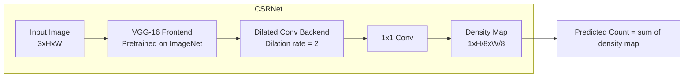

# Crowd Counting Pipeline

**Production-grade crowd counting using CSRNet with density map estimation.**

A modular, well-tested deep learning pipeline for estimating crowd counts from images using density map regression. Built with PyTorch, featuring experiment tracking (W&B), an interactive Gradio demo, Docker support, ONNX export, and CI/CD.

<!-- Uncomment once you have a demo deployed:
[](https://huggingface.co/spaces/YOUR_USERNAME/crowd-counting)
-->
[](https://github.com/YOUR_USERNAME/crowd-counting-pipeline/actions)
[](https://www.python.org/downloads/)
[](LICENSE)

---

## Architecture



**CSRNet** (Congested Scene Recognition Network) uses:
- **Frontend**: First 10 layers of VGG-16 (pretrained on ImageNet) for feature extraction
- **Backend**: 6 dilated convolutional layers that expand the receptive field without losing resolution
- **Output**: A 1x1 convolution producing a single-channel density map at 1/8 resolution

The predicted crowd count is the integral (sum) of the density map.

> **Paper**: [CSRNet: Dilated Convolutional Neural Networks for Understanding the Highly Congested Scenes](https://arxiv.org/abs/1712.03400) (CVPR 2018)

---

## Results

Evaluated on the **ShanghaiTech** crowd counting benchmark:

| Dataset | Split | MAE | RMSE |
|---|---|---|---|
| ShanghaiTech Part B | Test | 25.19 | — |
| ShanghaiTech Part A | Test | — | — |

*Part A results will be added after training. MAE = Mean Absolute Error (lower is better).*

---

## Quick Start

### Installation

```bash
# Clone the repository
git clone https://github.com/YOUR_USERNAME/crowd-counting-pipeline.git
cd crowd-counting-pipeline

# Create a virtual environment (recommended)
python -m venv venv
source venv/bin/activate   # On Windows: venv\Scripts\activate

# Install the package
pip install -e ".[all]"
```

### Inference (CPU — no GPU needed)

```bash
# Download trained weights from Google Drive / Releases and place in weights/

# Run on a single image
python scripts/infer.py --image path/to/crowd_image.jpg --checkpoint weights/best_model.pth --save-output
```

### Interactive Demo

```bash
# Launch Gradio demo (opens in browser)
make demo
# or: python -m crowd_counting.serving.gradio_app
```

### Training (GPU required — use Colab/Kaggle)

```bash
# Download the ShanghaiTech dataset
python -m crowd_counting.data.download --output-dir ./data

# Train on Part B
python scripts/train.py --config configs/shb.yaml --wandb

# Train on Part A
python scripts/train.py --config configs/sha.yaml --wandb
```

Or use the provided Colab notebook: [`notebooks/colab_training.ipynb`](notebooks/colab_training.ipynb)

### Evaluation

```bash
python scripts/evaluate.py \
    --config configs/shb.yaml \
    --checkpoint weights/best_model.pth \
    --save-viz
```

### ONNX Export

```bash
python scripts/export_onnx.py --checkpoint weights/best_model.pth
```

---

## Project Structure

```
crowd-counting-pipeline/
├── configs/                  # YAML configuration files
│   ├── default.yaml          # Base config with all defaults
│   ├── sha.yaml              # ShanghaiTech Part A overrides
│   └── shb.yaml              # ShanghaiTech Part B overrides
├── src/crowd_counting/       # Main Python package
│   ├── models/csrnet.py      # CSRNet architecture (VGG-16 + dilated convs)
│   ├── data/                 # Dataset, density maps, augmentations
│   ├── engine/               # Training and evaluation loops
│   ├── serving/              # Gradio demo
│   └── utils/                # Checkpointing, device, visualization
├── scripts/                  # CLI entry points
│   ├── train.py              # Training script
│   ├── evaluate.py           # Evaluation script
│   ├── infer.py              # Single-image inference
│   └── export_onnx.py        # ONNX export
├── notebooks/
│   └── colab_training.ipynb  # GPU training on Google Colab
├── tests/                    # Unit tests (pytest)
├── Dockerfile                # Containerized inference
├── Makefile                  # Common commands
└── pyproject.toml            # Package config & tool settings
```

---

## Development

```bash
# Install dev dependencies
make install-dev

# Run tests
make test

# Lint code
make lint

# Format code
make format
```

### Docker

```bash
# Build image
docker build -t crowd-counting .

# Run Gradio demo
docker run -p 7860:7860 crowd-counting
```

---

## Key Design Decisions

| Decision | Choice | Rationale |
|---|---|---|
| Config system | YAML + dataclass | Simple, no extra deps; configs are version-controlled |
| Experiment tracking | Weights & Biases | Industry standard, free tier, great visualization |
| Demo | Gradio | Easy deployment to Hugging Face Spaces |
| Training | Develop locally, train on Colab/Kaggle | No local GPU required |
| Testing | pytest (CPU-only) | Fast CI, no GPU needed for unit tests |
| Model export | ONNX | Framework-agnostic, production deployment ready |

---

## Deploy to Hugging Face Spaces

To deploy the Gradio demo as a free hosted app:

1. Create a [Hugging Face](https://huggingface.co) account
2. Create a new Space (select "Gradio" as the SDK)
3. Upload your trained weights (`weights/best_model.pth`) as a file in the Space
4. Push this repo's code to the Space repository
5. The app will auto-build and deploy at `https://huggingface.co/spaces/YOUR_USERNAME/crowd-counting`

---

## Future Work

- [ ] Add Vision-Language Model (e.g., LLaVA) for zero-shot crowd counting comparison
- [ ] Add LLM-powered natural language scene descriptions alongside counts
- [ ] Multi-scale testing for improved accuracy
- [ ] Cross-dataset generalization (train on Part A, test on Part B)
- [ ] Real-time video crowd counting pipeline

---

## Citation

If you use this work, please cite the original CSRNet paper:

```bibtex
@inproceedings{li2018csrnet,
  title={CSRNet: Dilated Convolutional Neural Networks for Understanding the Highly Congested Scenes},
  author={Li, Yuhong and Zhang, Xiaofan and Chen, Deming},
  booktitle={CVPR},
  year={2018}
}
```

---

## License

This project is licensed under the MIT License — see the [LICENSE](LICENSE) file for details.

